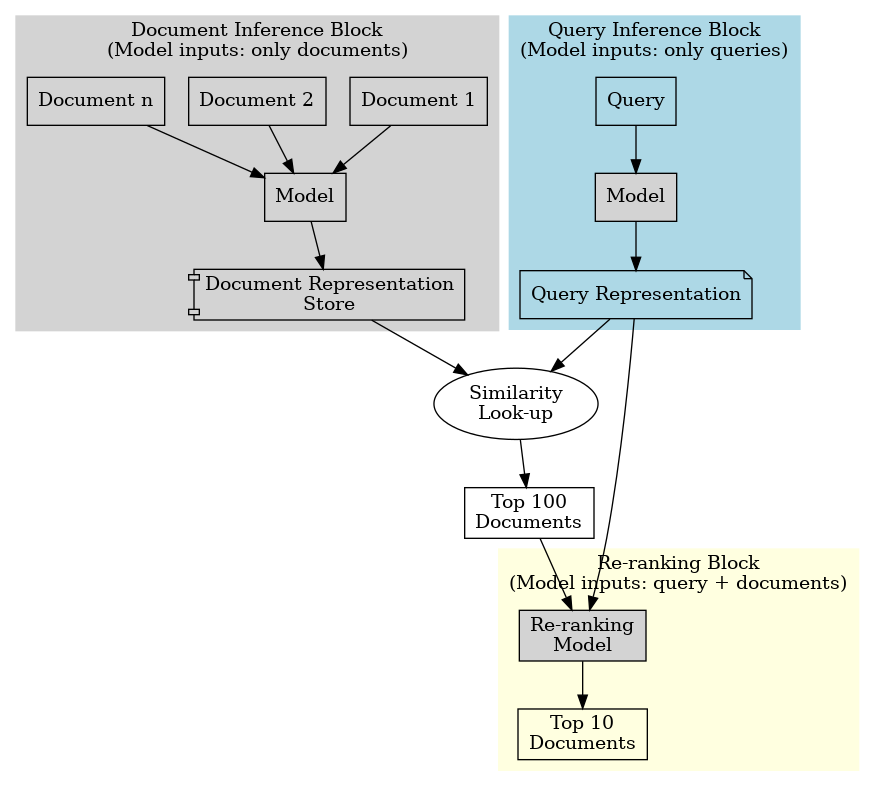

# Wolfram Blockchain Agent
This repository contains a prototype for the Wolfram Blockchain Agent that provides natural language access to blockchain data and insights. The system combines Wolfram's symbolic AI capabilities with large language models (LLMs) to make blockchain exploration more accessible.

## Project Background
This work builds upon previous projects funded by:
- Cardano Catalyst - Supporting foundational blockchain AI research
- XRPL Grants - Enabling real-time blockchain data integration (Wave 6)

The project leverages the [WAEXLink paclet](https://resources.wolframcloud.com/PacletRepository/resources/KirillBelov/WAEXLink) for Wolfram Language integration with blockchain data services.

API access for this project is provided through [EchoFeed](waexservices.com), offering comprehensive blockchain data.

## Features
- Natural language interface for blockchain queries
- Modular architecture for adding new data sources
- Integration with Wolfram computational tools
- Access to multiple blockchain data types:
    - Real-time pricing data
    - On-chain transaction data

## 
